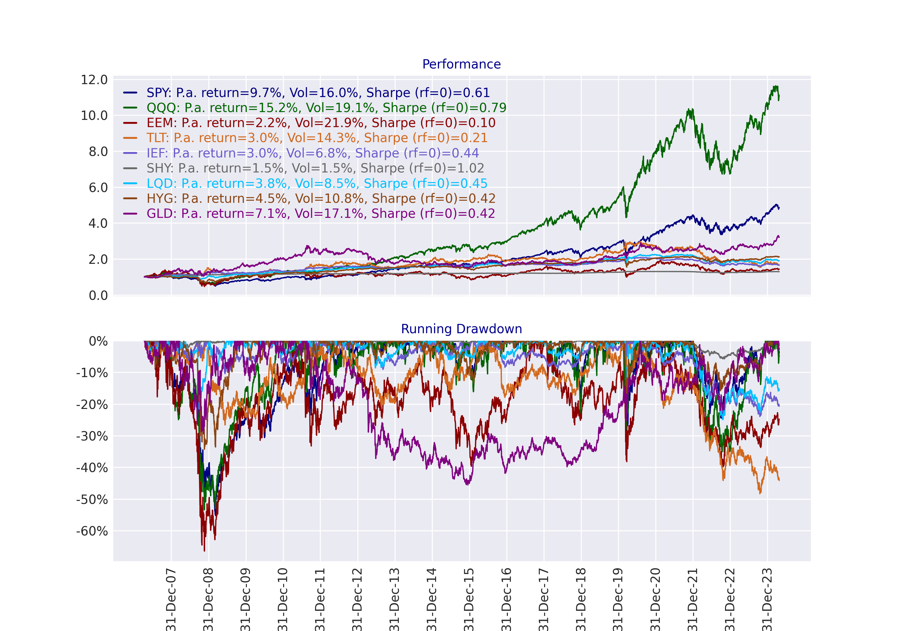

<strong>QIS: Quantitative Investment Strategies</strong>

The package implements analytics for visualisation of financial data, performance
reporting, analysis of quantitative strategies. 

# Table of contents
1. [Installation](#installation)
2. [Analytics](#analytics)
3. [Disclaimer](#disclaimer)    
4. [Contributions](#contributions)
5. [Examples](#examples)
   1. [Visualization of price data](#price)
6. [ToDos](#todos)

## **Installation** <a name="installation"></a>
```python 
pip install qis
```
```python 
pip install qis --upgrade
```

Core dependencies:
    python = ">=3.8,<3.11",
    numba = ">=0.56.4",
    numpy = ">=1.22.4",
    scipy = ">=1.10",
    statsmodels = ">=0.13.5",
    pandas = ">=1.5.2",
    matplotlib = ">=3.2.2",
    seaborn = ">=0.12.2",
    yfinance >= 0.1.38 (optional for getting test price data).

## **Analytics** <a name="analytics"></a>

The QIS package is split into 5 main modules with the 
dependecy path increasing sequentially as follows.

1. ```qis.utils``` is module containing low level utilities for operations with pandas, numpy, and datetimes.

2. ```qis.perfstats``` is module for computing performance statistics and performance attribution including returns, volatilities, etc.

3. ```qis.plots``` is module for plotting and visualization apis.

4. ```qis.models``` is module containing statistical models including filtering and regressions.

5. ```qis.portfolio``` is high level module for analysis, simulation, backtesting, and reporting of quant strategies.

```qis.examples``` contains scripts with illustrations of QIS analytics.

## **Disclaimer** <a name="disclaimer"></a>

QIS package is distributed FREE & WITHOUT ANY WARRANTY under the GNU GENERAL PUBLIC LICENSE.

See the [LICENSE.txt](https://github.com/ArturSepp/QuantInvestStrats/blob/master/LICENSE.txt) in the release for details.

Please report any bugs or suggestions by opening an [issue](https://github.com/ArturSepp/QuantInvestStrats/issues).

## **Contributions** <a name="contributions"></a>
If you are interested in extending and improving QIS analytics, 
please consider contributing to the library.

I have found it is a good practice to isolate general purpose and low level analytics and visualizations, which can be outsourced and shared, while keeping 
the focus on developing high level commercial applications.

There are a number of requirements:

- The code is [Pep 8 compliant](https://peps.python.org/pep-0008/)

- Reliance on common Python data types including numpy arrays, pandas, and dataclasses.

- Transparent naming of functions and data types with enough comments. Type annotations of functions and arguments is a must.

- Each submodule has a unit test for core functions and a localised entry point to core functions.

- Avoid "super" pythonic constructions. Readability is the priority.

## **Examples** <a name="examples"></a>

### Visualization of price data <a name="price"></a>

The script is located in ```qis.examples.performances```

```python 
import matplotlib.pyplot as plt
import seaborn as sns
import yfinance as yf
import qis
from qis import PerfStat

# define tickers and fetch price data
tickers = ['SPY', 'QQQ', 'EEM', 'TLT', 'IEF', 'LQD', 'HYG', 'GLD']
prices = yf.download(tickers, start=None, end=None)['Adj Close'][tickers].dropna()

# plotting price data with minimum usage
fig = qis.plot_prices(prices=prices)
```

```python 
# 2-axis plot with drawdowns using sns styles
with sns.axes_style("darkgrid"):
    fig, axs = plt.subplots(2, 1, figsize=(10, 7))
    qis.plot_prices_with_dd(prices=prices, axs=axs)
```

```python 
# plot risk-adjusted performance table with excess Sharpe ratio
ust_3m_rate = yf.download('^IRX', start=None, end=None)['Adj Close'].dropna() / 100.0
# set parameters for computing performance stats including returns vols and regressions
perf_params = qis.PerfParams(freq='M', freq_reg='Q', rates_data=ust_3m_rate)
fig = qis.plot_ra_perf_table(prices=prices,
                             perf_columns=[PerfStat.TOTAL_RETURN, PerfStat.PA_RETURN, PerfStat.VOL, PerfStat.SHARPE,
                                           PerfStat.SHARPE_EXCESS, PerfStat.MAX_DD, PerfStat.MAX_DD_VOL,
                                           PerfStat.SKEWNESS, PerfStat.KURTOSIS],
                             title=f"Risk-adjusted performance: {qis.get_time_period_label(prices, date_separator='-')}",
                             perf_params=perf_params)
```


## **ToDos and Contributions** <a name="todos"></a>

1. Enhanced documentation and readme examples.

2. Docstrings for key functions.

3. Reporting analytics and factsheets generation enhancing to matplotlib.

